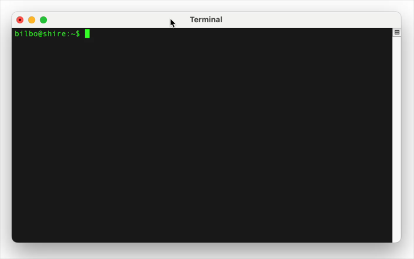

# pico-sshd
Experimental SSH server library for Raspberry Pi Pico W / Pico 2 W.

This is an interface library making it easy to add [wolfSSH](https://www.wolfssl.com/products/wolfssh/) "SSH Server" into Pico-SDK projects.

This software is under GPL license, while wolfSSH / wolfSSL is subject to its own license.



This library was created for [FanPico](https://github.com/tjko/fanpico/) 
and [BrickPico](https://github.com/tjko/brickpico/) projects.

## Features

*pico_sshd* provides a light-weight SSH server for Pico W.  This is meant to be used with the Pico-SDK.

* Provides _stdio_ driver so a SSH connection can be used as "console" for Pico W / Pico 2 W.
* "Interface" library that is easy to include in existing Pico-SDK projects.
* Support authentication via authentication callback.
* Default authentication callback (included) supports following authentication methods:
  - Password authentication against (Linux) SHA-512-Crypt hashed passwords.
  - Public key authentication

### Dependencies

This library is meant to be used with Raspberry Pi Pico-SDK and requires following additional libraries:

* [wolfSSH](https://github.com/wolfssl/wolfssh/)
* [wolfSSL](https://github.com/wolfssl/wolfssl/)


## Usage

### Including _pico_sshd_ in a project

First, get the library (this example adds it as a submodule to existing repository):
```
$ mkdir libs
$ cd libs
$ git submodule add https://github.com/tjko/pico-sshd.git
```

Then to use _pico_sshd_, add it in your CMakeLists.txt:
```
# include pico-sshd library
add_subdirectory(libs/pico-sshd)
```

### Including _wolfSSH_ and _wolfSSL_

_pico-sshd_ relies on wolfSSH/wolfSSL, so these must be included in your project as well.

This could be done as follows:
```
$ cd libs
$ git submodule add https://github.com/wolfSSL/wolfssh.git
$ git submodule add https://github.com/wolfSSL/wolfssl.git
````

Then add these libraries in your CMakeLists.txt:
```
# wolfSSL
set(WOLFSSL_ROOT ${CMAKE_CURRENT_SOURCE_DIR}/libs/wolfssl)
include(libs/pico-sshd/cmake/wolfssl_pico.cmake)

# wolfSSH
set(WOLFSSH_ROOT ${CMAKE_CURRENT_SOURCE_DIR}/libs/wolfssh)
include(libs/pico-sshd/cmake/wolfssh_pico.cmake)
```

#### Include wolfSSL configuration

Additionally configuration for wolfSSL (and wolfSSH) needs to be included by defining location where it
can be found in CMakeLists.txt.

Sample wolfSSL/wolfSSH configuration (user_settings.h) is included with _pico-sshd_ under as _wolfssl/user_settings.h_
which can be included directly (or you can create your own version and include it instead).

For example:
```
include_directories(libs/pico-sshd/wolfssl)
```


### Simple SSH Server (no authentication) as STDIO device

To add "ssh" support to a Pico W project, that allows accessing the unit over netrowk using SSH client, just like from Serial or USB (CDC) connection.

```
#include <pico-sshd.h>
...
<initialize networking>
...
ssh_server_t *sshserver = ssh_server_init(2048, 8192); // input and output buffer sizes
if (!sshserver)
    panic("out of memory);

// add server private key (DER format)
ssh_server_add_priv_key(sshserver, WOLFSSH_FORMAT_ASN1, privkey, privkey_size);

ssherver->auth_enabled = false;
ssh_server_start(sshserver, true);  // parameter tells whether to enable stdio driver or not... */

```


### Telnet Server with authentication on a non-standard port

Library includes simple default authentication callback that can perform password and publickey authentication
against list of authentication entries.  For more advanced authentication it is possible to provide your
own callback function (sshserver->auth_cb = mycallbackfunc;).

To use default authentication, context for authentication callback _auth_cb_ctx_ must be set to point to NULL terminated
list of authentication information (_ssh_user_auth_entry_t).

```
#include <pico_telnetd.h>
#include <pico_telnetd/util.h>

/* List of users (authentication entries) with type, username, authentication data (password hash or public key), autentication data length */

char* admin_pw_hash = "$6$caRtcnraEpbI48d3$YizNnV2hIwqZ/Gu4jh9ebV/DXCRhCzvUM2E0yTF3BgGrMw1HrfYIJJ9CQ0rcVBbpScCfwBtKhynVpKSnW/5o..";
uint8_t* jonn_pkey = { 0x10, ... };

ssh_user_auth_entry_t users[] = {
	{ WOFLSSH_USERAUTH_PASSWORD, "admin", admin_pw_hash, strlen(admin_pw_hash) },
        { WOLFSSH_USERAUTH_PUBLICKEY, "john", john_pkey, john_pkey_length },
	{ 0, NULL, NULL, 0 }
};


ssh_server_t *sshserver = telnet_server_init(2048, 8192);
if (!sshserver)
    panic("out of memory);

sshserver->port = 8000;
sshserver->auth_cb_ctx = (void*)users;

// add server private key (DER format)
ssh_server_add_priv_key(sshserver, WOLFSSH_FORMAT_ASN1, privkey, privkey_size);

ssh_server_start(sshserver, true);  // parameter tells whether to enable stdio driver or not... */

```

## Additional Features

### Authentication
pico_sshd includes simple default authentication function.
This might not be suitable for all use cases, to it is possible to provide your own authentication
callback function by setting _auth_cb_ before calling ssh_server_start().

```
int my_auth_cb(void *ctx, const byte *login, word32 login_len,
               const byte *auth, word32 auth_len, int auth_type)
{
  if <user password is valid> {
    return 0;
  }
  // return non-zero on failure...
  return 1;
}

...

sshserver->auth_cb = my_auth_cb;
ssh_server_start(sshserver, true);
...
```


### Logging
#### Controlling Logging

By default _pico-sshd_ logs errors to stdout. Loggin verbosity can be configured by setting logging level:
```
#include <pico_telnetd/log.h>

sshd_log_level(LOG_INFO);
```


#### Custom logging

To completely control logging, it is possible to provide custom callback for the logging:
```
void my_logger(int priority, const char *format, ...)
{
<implement custom logging here>
}

...
sshserver->log_cb = my_logger;
ssh_server_start(sshserver, true);
...
```


#### Disabling logging completely

To disable logging done by the library completely. Simply set the _log_cb_ to NULL.

```
...
sshserver->log_cb = NULL;
ssh_server_start(sshserver, true);
...
```


### Usage withouth SDTIO

Telnet server can alternatively be used withouth stdio, by setting stdio parameter to _false_:

```
ssh_server_start(telnetserver, false);
```

#### Reading Data Received from Client

Received data is stored in the _rb_in_ ringbuffer.

Ringbuffer can be read charcter by character using _ssh_ringbuffer_read_char()_ function:
```
...
int in;
while ((in = ssh_ringbuffer_read_char(&sshserver->rb_in)) >= 0) {
  printf("Received byte: %02x (%c)\n", in, isprint(in) ? in : '?');
}
...
```

Alternatively larger blocks can be read from ring buffer using _ssh_ringbuffer_read()_ function:
```
size_t bytes_waiting = ssh_ringbuffer_size(&sshserver->rb_in);
if (bytes_waiting > 0) {
  ssh_ringbuffer_read(&sshserver->rb_in, buffer, bytes_waiting);  // make sure buffer is large enough...
}
```


#### Sending Data to Client

Data added to ringbuffer _rb_out_, will be transmitted to the client.

Data can be added to ringbuffer either one character at the time using _ssh_ringbuffer_add_char()_ function:
```
for (int i = 0; i < strlen(buf); i++) {
	ssh_ringbuffer_add_char(&sshserver->rb_out, buf[i], true);  // Last argument controls wheter to overwrite in case ringbuffer fills up...
}
```

Or larger blocks can be sent uainf _ssh_ringbuffer_add()_ function:
```
// add data to ringbuffer withouth overwriting data if buffer woud fill up (overwrite parameter set to false)
int err = ssh_ringbuffer_add(&sshserver->rb_out, buf, buffer_len, false);
if (err != 0) {
   // buffer would fill up
}
```

## Examples
See [src/sshd.c](https://github.com/tjko/fanpico/blob/main/src/sshd.c) in FanPico project for actual usage example.

